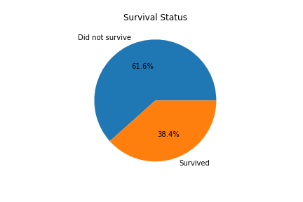
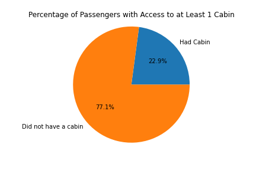
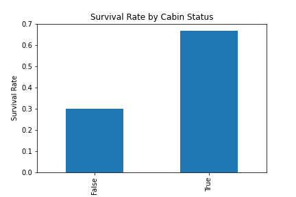
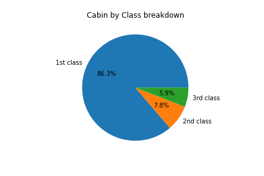
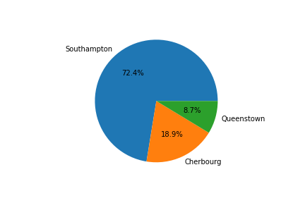

# Titanic Analysis using Python

### Overview of the analysis

# The purpose of this analysis was to gain some insight on the passengers of the Titanic by looking at the:

1. Overall survival rate
2. Age distribution and survival rate by age group
3. Gender breakdown and survival rate by gender
4. Class breakdown and survival rate by socio-economic-status
5. Percentage of passengers who had access to a cabin and their survival rate
6. Of those passengers who had access to a cabin, how many belonged to which class
7. Breakdown of passengers by which port they embarked from and the corresponding survival rates

### Results

1. The overall survival rate of passengers in this dataset is shown below.

2. The histogram below displays the age distribution of all the passengers in this dataset. As you can see below, a large portion of the passengers were between the ages of 18 and 35.

After breaking down the ages into 4 groups: 0-18, 18-30, 30-50, and 50-80, I calculated the survival rate by age group. As you can see below:

a. passengers 0-18 had an average survival rate of around 50%
b. passengers 18-30 had an average survival rate of around 35%
c. passengers 30-50 had an average survival rate of around 42%
d. passengers 50-80 had an average survival rate of around 34%

3. The breakdown of passengers in this dataset by gender is shown below.

The bar chart below displays the survival rate by gender. As you can see, even though we began with roughly 65% male passengers, only about 19% of them survived. Whereas we began with roughly 35% female passengers and over 74% of them survived.

4. The breakdown of passengers in this dataset by socio-economic-status is shown below.

The bar chart below displays the survival rate by socio-economic-status. Roughly 63% of survivors were from the 1st class, 47% from the 2nd class, and 24% from the 3rd class.

5. The breakdown of passengers in this dataset who had access to at least 1 cabin is shown below.

The bar chart below displays the survival rate by cabin status. Those who had access to a cabin had an average survival rate of over 66%. Those who did not have access to a cabin had an average survival rate of less than 30%.

6. As you can see below, of the passengers who did have access to a cabin:

a. Over 86% belonged to the 1st class
b. Less than 8% belonged to the 2nd class
c. Less than 6% belonged to the 3rd class

7. The breakdown of passengers by which port they embarked from is shown below. Over 72% from Southampton, roughly 19% from Cherbourg, and less than 9% from Queenstown.

The bar chart below displays the survival rate by port of embarkation. Over 55% of survivors embarked from Cherbourg, 39% from Queenstown, and 33% from Southampton.

